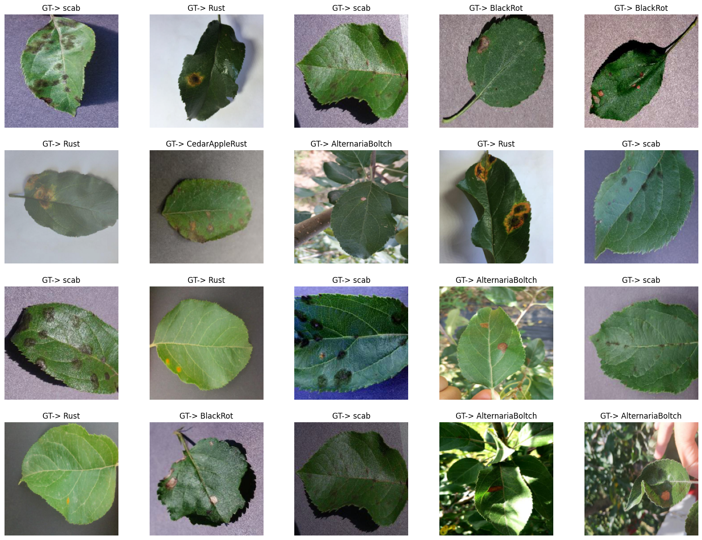
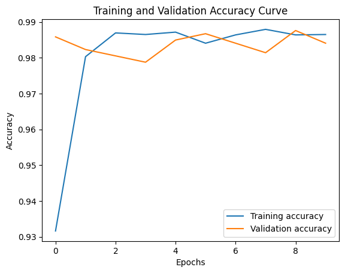
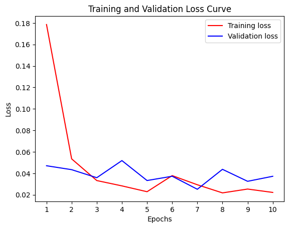

# Apple Disease Classification
## Project Overview
This project develops a deep learning model to classify apple disease 5 conditions: 'AlternariaBoltch', 'BlackRot', 'CedarAppleRust', 'Rust', 'scab'. Built with PyTorch and Timm, the model leverages transfer learning for high accuracy, and Streamlit is used to create an interactive web demo.

## Installation

To set up the project environment:
#### 1-method

```bash
git clone https://github.com/cengineer13/Apple-disease-classification-.git
cd Apple-disease-classification
```

#### 2-method

Create conda environment using two methods:

a) Create a virtual environment using txt file:

- Create a virtual environment:

```python
conda create -n ds python=3.10
```

- Activate the environment using the following command:

```python
conda activate ds
```

- Install libraries from the text file:

```python
pip install -r requirements.txt
```

## Dataset
* Download dataset from the [link](https://www.kaggle.com/datasets/killa92/apple-disease-dataset)

This dataset contains 11,297 images of various apple diseases. The dataset can be used for image classification and semantic segmentation tasks. 


<h4 align="center"> Dataset examples</h4>



<h4 align="center"> Validation dataset examples</h4>


These images are random visualizations from the training, validation, and test sets.

## Model Performance

The model's training and validation metrics are visualized below:




### Summary:
The model learns effectively, as shown by rapid improvements in training metrics. Both loss curves converging at a low value by the end indicate good model stability and generalization at the end of training. Further measures might be considered to narrow the gap between training and validation accuracy to ensure the model generalizes well to new data.
The curves represent the model's accuracy and loss over epochs, indicating the learning process and convergence.

## Inference

Here's how the model performs on the test set:


Each row shows the ground truth and predicted label for brain CT images.

## GradCAM Visualizations

The model's attention is visualized using GradCAM, which helps understand which regions of the images influenced the predictions:


Each image highlights the areas most influential for the model's predictions.


## Testing on New Data &  Interactive Web Demo

A Streamlit web app (`demo apple disease.py`) allows users to upload an image and receive model predictions in a user-friendly interface.

```bash
streamlit run "demo apple_desease.py"
```
Result: 


To evaluate the model on new, I used this unseen images:


These are examples of new data images passed through the model.


## Contributing

We welcome contributions from the community. Please read the contributing guidelines first before making a pull request.


## Contact

Mr Murodil  - murodild@gmail.com
LinkedIn - https://www.linkedin.com/in/mr-murodil
Project Link: [https://github.com/cengineer13/brain-ct-classification](https://github.com/cengineer13/Apple-disease-classification-)
